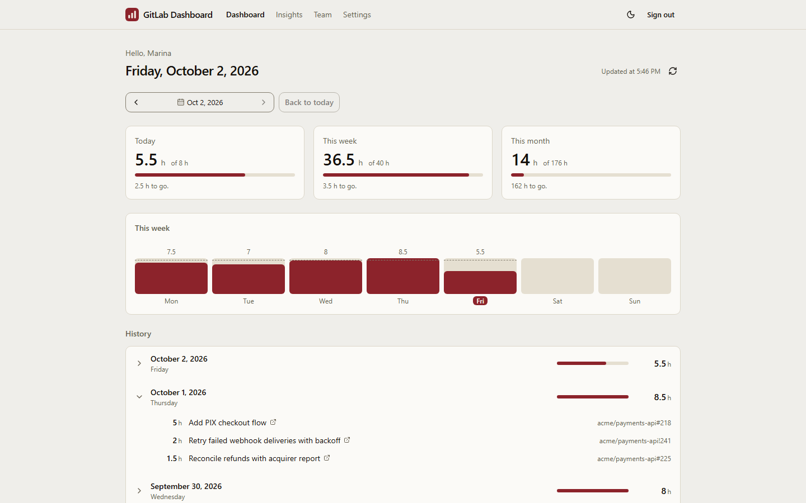
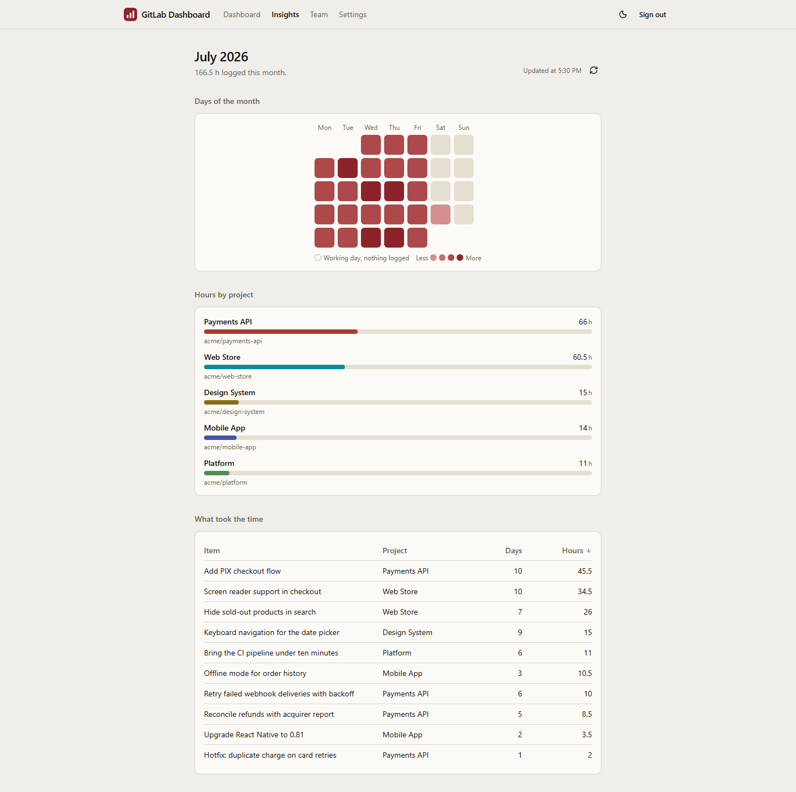
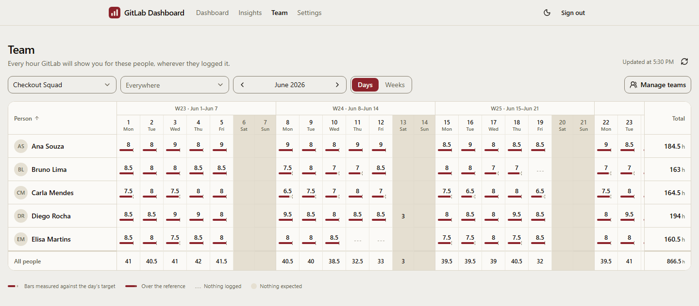

<div align="center">

#  GitLab Dashboard

**The hours you log in GitLab — by day, by month, by project and by team, at a glance.**

[](https://github.com/rafaeldailymartins/gitlab-dashboard/actions/workflows/ci.yml)
[](https://github.com/rafaeldailymartins/gitlab-dashboard/actions/workflows/ci.yml)
[](https://github.com/rafaeldailymartins/gitlab-dashboard/actions/workflows/mutation.yml)
[](https://scorecard.dev/viewer/?uri=github.com/rafaeldailymartins/gitlab-dashboard)
[](https://gitlabdashboard.netlify.app/)


[🇺🇸 English](README.md) · [🇧🇷 Português](README.pt-BR.md)

### 🔗 [gitlabdashboard.netlify.app](https://gitlabdashboard.netlify.app/)

</div>

## 💡 About

At the company where I work, people log the hours they put into each project
as time tracking on GitLab issues and merge requests. GitLab keeps every entry,
but it is hard to see how many hours were logged in a day, in a month or on a
project — and harder still for managers to follow the hours of the people on
their teams. **GitLab Dashboard** was built for exactly that: you sign in with
your own GitLab account and see those hours aggregated in a dashboard that is
easy to read, for yourself and for the teams you follow.

🤖 The project was developed with
[Claude Code](https://claude.com/claude-code). Each change was planned as an
[OpenSpec](https://github.com/Fission-AI/OpenSpec) proposal, following the rules
in [`AGENTS.md`](AGENTS.md), with the quality gates below enforced in CI.

## 📸 Screenshots

**Dashboard** — today, this week and this month, the week day by day, and your history



**Insights** — the month heatmap, hours by project and what took the time



**Team month** — people down the side, days across the top



## ✨ Features

- 🏠 **Dashboard** — hours for today, this week and this month, each against the
  target you set for those weekdays; a bar per day of the current week with the
  target on the same scale; and your whole history, newest day first, each day
  opening into the issues and merge requests it went into.
- 📅 **A day on its own address** — `/days/2026-08-21` can be linked and
  reloaded, with every work item and its hours.
- 📈 **Insights** — a square per day of the month, hours split by project, and a
  sortable table of what took the time.
- 👥 **A team's month** — the people on a team down the side, the days (or
  weeks) across the top, and each cell measured against your working schedule.
  Everybody you chose keeps a row, including somebody who logged nothing. An
  optional group filter narrows the figures to one GitLab group.
- 🧑‍🤝‍🧑 **Teams** — name a GitLab group and the team is built in one click from
  whoever logged time there in the last 30 days; then search anybody by name,
  take people off, or add another group's people. Edits are saved on purpose,
  with Save and Cancel.
- ⚙️ **Settings** — hours per weekday and the time zone that decides when a day
  starts follow you across devices; language (English or Brazilian Portuguese)
  and colour scheme (light, dark or system) stay on the device.
- 🔐 **Your own GitLab sign-in** — OAuth with PKCE, read-only. There is no
  Personal Access Token to paste anywhere.

## 🧱 Tech stack

| Area          | Choice                                                                   |
| ------------- | ------------------------------------------------------------------------ |
| UI            | React 19, TypeScript, Tailwind CSS v4, shadcn/ui on Base UI              |
| Routing, data | TanStack Router (file-based SPA routes) and TanStack Query               |
| Build         | Vite, with a Content-Security-Policy written after the build             |
| i18n          | Paraglide JS — English and Brazilian Portuguese                          |
| Backend       | Two Netlify Functions over Netlify Blobs, `jose` verifying GitLab tokens |
| Tooling       | Bun as package manager, script runner and runtime                        |
| Architecture  | Feature-Sliced Design outside, Clean Architecture inside each slice      |

## 🏗️ How it works

```
Browser (static files on a CDN)
  ├── PKCE authorize   ──> gitlab.com/oauth/authorize
  ├── token / refresh  ──> gitlab.com/oauth/token      (no client secret)
  ├── hours            ──> gitlab.com/api/graphql      (Bearer, CORS allows it)
  ├── teams            ──> /.netlify/functions/teams        (id_token, same origin)
  └── settings         ──> /.netlify/functions/preferences  (id_token, same origin)
```

- **The browser talks to GitLab's GraphQL API directly.** No hours pass through
  a server of this app.
- **Your own hours are read newest first and cut locally**, in your time zone.
  GitLab truncates a requested period to UTC calendar days, so asking it for "this
  month" would disagree with the days on screen.
- **A return visit paints before any request**: your hours are cached in
  IndexedDB, and signing out clears them.
- **A team's month is one request**, per-person totals included, and those totals
  are how the report notices hours GitLab withheld from you. None of it is
  written to the device — those hours belong to other people.
- **Two serverless functions keep what has to follow you**: your teams and your
  working schedule, so the same team and the same targets are there on the laptop
  and on the phone.

[`AGENTS.md`](AGENTS.md) documents the architecture and every decision behind it.

## 🚀 Getting started

### 📋 Prerequisites

- [Bun](https://bun.sh) 1.4 or newer
- [Node.js](https://nodejs.org) 24 or newer (Stryker, Playwright and the
  preview server it tests against still run on Node)

### 1. Create a GitLab OAuth application

A one-time, self-service step in your own GitLab account — no administrator
involved.

1. Open **GitLab → User Settings → Applications → Add new application**.
2. Name it anything, for example `GitLab Dashboard`.
3. Add both redirect URIs, one per line:
   ```
   http://localhost:3000/auth/callback
   https://<your-site>.netlify.app/auth/callback
   ```
4. **Leave "Confidential" unchecked.** The app is a public client using PKCE, so
   there is no client secret to protect.
5. Tick the scopes **`read_api`** and **`openid`**, and nothing else. The app
   never writes to GitLab; `openid` only lets GitLab state who you are, in a
   short-lived signed token the two endpoints verify.
6. Save, and copy the **Application ID**.

> [!IMPORTANT]
> Tick `openid` **before** deploying a bundle that asks for it. GitLab checks an
> authorize request against the application's scopes, so the other order fails
> every sign-in with `invalid_scope`. A session granted before the scope was
> added keeps working; it only shows a notice asking you to sign in again.

### 2. Configure

```bash
cp .env.example .env
```

Put the Application ID in `VITE_GITLAB_CLIENT_ID`. It is public by design — it
ships inside the bundle, which is how a PKCE public client works. There is no
secret in this repository.

### 3. Run

```bash
bun install
bun run dev
```

Open http://localhost:3000 and sign in with GitLab. Both endpoints are served by
the dev server itself, over an in-memory store.

## 🧪 Scripts

| Command                 | What it does                                                               |
| ----------------------- | -------------------------------------------------------------------------- |
| `bun run dev`           | Dev server on http://localhost:3000                                        |
| `bun run verify`        | Every fast gate: format, lint, ARIA, contrast, i18n, types, architecture … |
| `bun run test`          | Unit, component, Gherkin domain and endpoint tests                         |
| `bun run test:coverage` | The same, with the coverage thresholds enforced                            |
| `bun run test:e2e`      | The acceptance suite — Chromium locally, three browsers in CI              |
| `bun run test:mutation` | Mutation testing on the model layer                                        |
| `bun run build`         | Production build into `dist/`, plus its CSP                                |

## ✅ Quality gates

Everything below fails the build rather than warning. All of it runs on every
pull request in [GitHub Actions](https://github.com/rafaeldailymartins/gitlab-dashboard/actions),
except mutation testing, which runs weekly:

| Gate                               | Where                                 |
| ---------------------------------- | ------------------------------------- |
| 90% coverage, **100% on `model/`** | `bun run test:coverage`               |
| Mutation score ≥ 85% on `model/`   | `bun run test:mutation`, weekly in CI |
| Zero dependency vulnerabilities    | `bun audit`                           |
| No new vulnerable package, at all  | dependency review, over `bun.lock`    |
| 180 kB gzip initial bundle         | `size-limit`                          |
| Zero axe violations, both themes   | the acceptance suite                  |
| Layout shift under 0.1             | the acceptance suite                  |
| No sideways scrolling at 375 px    | the acceptance suite                  |
| Every requirement cited by a test  | `bun run arch:trace`                  |

[`docs/qa/`](docs/qa/) holds the test plan, the manual regression pass, the
browser matrix, the screen-reader procedure, the release checklist and the
measured value of every gate.

## 🔒 Security and privacy

Found a vulnerability? Please report it privately, as [`SECURITY.md`](SECURITY.md)
describes, rather than in a public issue.

- **Zero known vulnerabilities, at any severity.** A dependency with an
  unfixable advisory does not come in: Lighthouse CI is not used because
  `@lhci/cli` pulls in vulnerable `puppeteer` → `extract-zip`, `tmp` and `uuid`
  (performance is guarded by the bundle budget and the layout-shift assertion
  instead), and `qs` is pinned through `overrides` because Stryker reaches an
  older one.
- **Tokens.** The access token lives in memory only, and a test asserts it never
  reaches storage. The refresh token is kept in `localStorage` and rotates on
  every use. The scope is `read_api openid` and nothing more.
- **Who is calling is proved, not claimed.** Both endpoints verify GitLab's
  `id_token` offline against GitLab's published keys (RS256 named, audience
  checked, nothing older than 150 seconds accepted). The storage key is derived
  from that verified identity and from nothing the request carried, so reaching
  somebody else's data is not expressible. A write must name the version it
  was made against, or it is refused.
- **No cookies and no CORS headers**, so there is no cross-site request to
  forge.
- **A strict Content-Security-Policy** — `default-src 'none'`, `connect-src`
  limited to this origin and your GitLab — with the hash of the one inline
  script, written by `bun run csp` into `dist/_headers`.

> [!NOTE]
> **What the host can see.** Netlify Blobs holds each document as it was
> written, unencrypted: your teams — the names, usernames and GitLab ids of the
> colleagues you put on them — and your daily targets and time zone. No hours
> are ever stored there, but whoever can reach the site's blob store can see
> which colleagues you grouped together.

## ☁️ Deployment

The app deploys to [Netlify](https://www.netlify.com/) as static files plus the
two functions in `netlify/functions/`. Production is built from `main`;
homologation from `staging`, at
[staging--gitlabdashboard.netlify.app](https://staging--gitlabdashboard.netlify.app/),
with teams and schedules of its own; and every pull request gets a deploy
preview.

1. Set `VITE_GITLAB_CLIENT_ID` in the site's environment variables, for every
   deploy context — the functions read the same one. On a self-managed GitLab,
   set `VITE_GITLAB_BASE_URL` beside it; it defaults to `https://gitlab.com`.
2. Add production's and staging's `/auth/callback` to the OAuth application's
   redirect URIs.
3. Tick `openid` on the application before the first deploy that asks for it.

Those three fail at sign-in rather than at build time.
[`docs/qa/release-checklist.md`](docs/qa/release-checklist.md) is the full pass.

## 🤝 Contributing

Changes go into `staging` by pull request, and `staging` is promoted to `main`;
every merge into `main` is a tagged release whose notes come from its commits.
[`CONTRIBUTING.md`](CONTRIBUTING.md) has the environments, the branch names,
hotfixes, promotion and the commit convention.

## 📄 License

Copyright © 2026 Rafael Daily Santos Martins. Released under the
[GNU Affero General Public License v3.0](LICENSE) (`AGPL-3.0-only`).

You may use, study, change and share this code, commercially or not. What the
licence asks in return is that anybody who gives others a changed version,
whether as files or as a service they reach over a network, also gives them its
source, under these same terms. A licence on other terms is available from the
author; get in touch through [GitHub](https://github.com/rafaeldailymartins).

## 👨‍💻 Author

Created and maintained by:

| [<br /><sub><b>Rafael Daily</b></sub>](https://github.com/rafaeldailymartins) |
| :-----------------------------------------------------------------------------------------------------------------------------------------------------------: |
