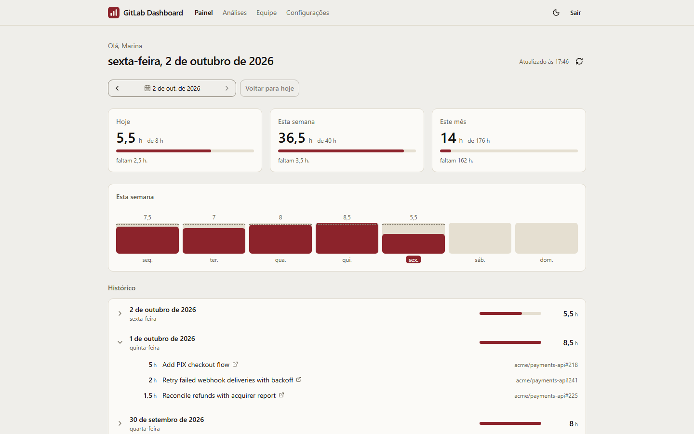
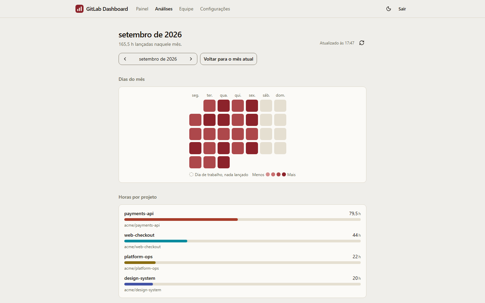
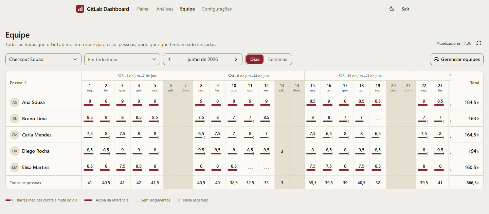

<div align="center">

#  GitLab Dashboard

**As horas que você lança no GitLab — por dia, por mês, por projeto e por equipe, num relance.**

[](https://github.com/rafaeldailymartins/gitlab-dashboard/actions/workflows/ci.yml)
[](https://github.com/rafaeldailymartins/gitlab-dashboard/actions/workflows/ci.yml)
[](https://github.com/rafaeldailymartins/gitlab-dashboard/actions/workflows/mutation.yml)
[](https://scorecard.dev/viewer/?uri=github.com/rafaeldailymartins/gitlab-dashboard)
[](https://gitlabdashboard.netlify.app/)


[🇺🇸 English](README.md) · [🇧🇷 Português](README.pt-BR.md)

### 🔗 [gitlabdashboard.netlify.app](https://gitlabdashboard.netlify.app/)

</div>

## 💡 Sobre

Na empresa em que eu trabalho, as pessoas lançam as horas que dedicam a cada
projeto como time tracking em issues e merge requests do GitLab. O GitLab guarda
cada lançamento, mas é difícil acompanhar quantas horas foram lançadas por dia,
por mês ou por projeto — e mais difícil ainda para os gestores acompanharem as
horas trabalhadas pelas pessoas das suas equipes. O **GitLab Dashboard** foi criado
para isso: você entra com a sua própria conta do GitLab e vê essas horas
agregadas num dashboard de fácil visualização, para você e para as equipes
que acompanha.

🤖 O projeto foi desenvolvido com o
[Claude Code](https://claude.com/claude-code). Cada mudança foi planejada como
uma proposta do [OpenSpec](https://github.com/Fission-AI/OpenSpec), seguindo as
regras do [`AGENTS.md`](AGENTS.md), com os gates de qualidade abaixo aplicados
no CI.

## 📸 Screenshots

**Painel** — hoje, esta semana e este mês, a semana dia a dia e o seu histórico, ou tudo isso a partir de qualquer dia que você escolher



**Análises** — o mapa de calor de um mês, as horas por projeto e no que o tempo foi, do mês atual ou de qualquer mês anterior



**Mês da equipe** — as pessoas nas linhas, os dias nas colunas



## ✨ Funcionalidades

- 🏠 **Painel** — horas de hoje, da semana e do mês, cada uma comparada com a
  meta que você definiu para aqueles dias da semana; uma barra por dia da semana
  atual, com a meta na mesma escala; e todo o seu histórico, do dia mais recente
  para o mais antigo, cada dia abrindo nas issues e merge requests em que as
  horas foram lançadas. Volte um dia ou escolha qualquer data e a tela inteira
  passa a ser lida a partir dela: aquele dia, a semana dele, o mês dele e o
  histórico anterior.
- 📅 **Um dia com endereço próprio** — `/days/2026-08-21` pode ser compartilhado
  e recarregado, com cada item de trabalho e suas horas.
- 📈 **Análises** — um quadrado por dia do mês, as horas divididas por projeto e
  uma tabela ordenável mostrando no que o tempo foi, do mês atual ou de qualquer
  mês anterior.
- 🔗 **Datas no endereço** — `/?date=2026-08-21` e `/insights?month=2026-08`
  sobrevivem a um recarregamento e podem ser enviados a alguém; um endereço sem
  data sempre significa hoje.
- 👥 **O mês de uma equipe** — as pessoas de uma equipe nas linhas, os dias (ou as
  semanas) nas colunas, e cada célula medida contra a sua jornada de trabalho.
  Todo mundo que você escolheu mantém a sua linha, inclusive quem não lançou
  nada. Um filtro opcional de grupo restringe os números a um grupo do GitLab.
- 🧑‍🤝‍🧑 **Equipes** — informe um grupo do GitLab e a equipe é montada num clique com
  quem lançou horas nele nos últimos 30 dias; depois é só buscar qualquer pessoa
  pelo nome, tirar alguém ou adicionar as pessoas de outro grupo. As edições são
  salvas de propósito, com Salvar e Cancelar.
- ⚙️ **Configurações** — as horas por dia da semana e o fuso horário que decide
  quando um dia começa acompanham você entre dispositivos; o idioma (inglês ou
  português do Brasil) e o esquema de cores (claro, escuro ou do sistema) ficam
  no dispositivo.
- 🔐 **Login com a sua conta do GitLab** — OAuth com PKCE, somente leitura. Não
  existe Personal Access Token para colar em lugar nenhum.

## 🧱 Tecnologias

| Área          | Escolha                                                                          |
| ------------- | -------------------------------------------------------------------------------- |
| Interface     | React 19, TypeScript, Tailwind CSS v4, shadcn/ui sobre Base UI                   |
| Rotas e dados | TanStack Router (rotas de SPA por arquivo) e TanStack Query                      |
| Build         | Vite, com uma Content-Security-Policy gerada depois do build                     |
| i18n          | Paraglide JS — inglês e português do Brasil                                      |
| Backend       | Três Netlify Functions sobre Netlify Blobs, com `jose` verificando tokens GitLab |
| Monitoramento | Sentry, região UE, só erros, por um túnel nesta origem                           |
| Ferramentas   | Bun como gerenciador de pacotes, executor de scripts e runtime                   |
| Arquitetura   | Feature-Sliced Design por fora, Clean Architecture dentro de cada slice          |

## 🏗️ Como funciona

```
Navegador (arquivos estáticos numa CDN)
  ├── autorização PKCE ──> gitlab.com/oauth/authorize
  ├── token / refresh  ──> gitlab.com/oauth/token      (sem client secret)
  ├── horas            ──> gitlab.com/api/graphql      (Bearer, o CORS permite)
  ├── equipes          ──> /.netlify/functions/teams        (id_token, mesma origem)
  ├── configurações    ──> /.netlify/functions/preferences  (id_token, mesma origem)
  └── falhas           ──> /.netlify/functions/monitor      (mesma origem) ──> Sentry, UE
```

- **O navegador fala direto com a API GraphQL do GitLab.** Nenhuma hora passa por
  um servidor desta aplicação.
- **As suas horas são lidas das mais recentes para as mais antigas e cortadas
  localmente**, no seu fuso horário. O GitLab trunca um período pedido para dias
  UTC, então pedir "este mês" a ele discordaria dos dias na tela.
- **Uma nova visita aparece antes de qualquer requisição**: as suas horas ficam
  em cache no IndexedDB, e sair da conta apaga esse cache.
- **O mês de uma equipe é uma única requisição**, com os totais por pessoa, e são
  esses totais que permitem ao relatório perceber horas que o GitLab escondeu de
  você. Nada disso é gravado no dispositivo — essas horas são de outras pessoas.
- **Duas funções serverless guardam o que precisa acompanhar você**: as suas
  equipes e a sua jornada, para que a mesma equipe e as mesmas metas estejam no
  notebook e no celular.
- **Uma falha chega ao autor, e nada sobre você vai junto.** Um erro que nada
  capturou, uma rota que falhou e uma requisição ao GitLab que não pôde ser
  respondida são reportados ao Sentry, reconstruídos só com o que localiza a
  falha. O código que os envia é buscado depois que a página aparece.

O [`AGENTS.md`](AGENTS.md) documenta a arquitetura e cada decisão por trás dela
(em inglês).

## 🚀 Como rodar

### 📋 Pré-requisitos

- [Bun](https://bun.sh) 1.4 ou mais recente
- [Node.js](https://nodejs.org) 24 ou mais recente (o Stryker, o Playwright e o
  servidor de preview que ele testa ainda rodam no Node)

### 1. Crie uma aplicação OAuth no GitLab

É um passo único, feito por você mesmo na sua conta do GitLab — sem precisar de
um administrador.

1. Abra **GitLab → User Settings → Applications → Add new application**.
2. Dê qualquer nome, por exemplo `GitLab Dashboard`.
3. Adicione as duas redirect URIs, uma por linha:
   ```
   http://localhost:3000/auth/callback
   https://<seu-site>.netlify.app/auth/callback
   ```
4. **Deixe "Confidential" desmarcado.** A aplicação é um cliente público que usa
   PKCE, então não existe client secret para proteger.
5. Marque os escopos **`read_api`** e **`openid`**, e nenhum outro. A aplicação
   nunca escreve no GitLab; o `openid` só permite que o GitLab diga quem você é,
   num token assinado de curta duração que os dois endpoints verificam.
6. Salve e copie o **Application ID**.

> [!IMPORTANT]
> Marque o `openid` **antes** de publicar um bundle que o solicita. O GitLab
> valida o pedido de autorização contra os escopos da aplicação, então na ordem
> inversa todo login falha com `invalid_scope`. Uma sessão concedida antes de o
> escopo ser adicionado continua funcionando; ela só mostra um aviso pedindo para
> entrar de novo.

### 2. Configure

```bash
cp .env.example .env
```

Coloque o Application ID em `VITE_GITLAB_CLIENT_ID`. Ele é público por natureza
— vai dentro do bundle, que é como um cliente público com PKCE funciona. Não há
nenhum segredo neste repositório.

### 3. Rode

```bash
bun install
bun run dev
```

Abra http://localhost:3000 e entre com o GitLab. Os dois endpoints são servidos
pelo próprio servidor de desenvolvimento, sobre um armazenamento em memória.

## 🧪 Scripts

| Comando                 | O que faz                                                                             |
| ----------------------- | ------------------------------------------------------------------------------------- |
| `bun run dev`           | Servidor de desenvolvimento em http://localhost:3000                                  |
| `bun run verify`        | Todos os gates rápidos: formatação, lint, ARIA, contraste, i18n, tipos, arquitetura … |
| `bun run test`          | Testes unitários, de componente, de domínio em Gherkin e dos endpoints                |
| `bun run test:coverage` | Os mesmos, com os limites de cobertura aplicados                                      |
| `bun run test:e2e`      | A suíte de aceitação — Chromium localmente, três navegadores no CI                    |
| `bun run test:mutation` | Testes de mutação na camada de modelo                                                 |
| `bun run build`         | Build de produção em `dist/`, com a sua CSP                                           |

## ✅ Gates de qualidade

Tudo abaixo quebra o build em vez de só avisar. Tudo roda em cada pull request
no [GitHub Actions](https://github.com/rafaeldailymartins/gitlab-dashboard/actions),
menos os testes de mutação, que rodam toda semana:

| Gate                                       | Onde                                   |
| ------------------------------------------ | -------------------------------------- |
| 90% de cobertura, **100% em `model/`**     | `bun run test:coverage`                |
| Score de mutação ≥ 85% em `model/`         | `bun run test:mutation`, semanal no CI |
| Zero vulnerabilidades em produção          | `bun run security:audit`               |
| Nenhum pacote vulnerável novo, sem exceção | dependency review, sobre o `bun.lock`  |
| Bundle inicial de até 196 kB gzip          | `size-limit`                           |
| Zero violações do axe, nos dois temas      | a suíte de aceitação                   |
| Layout shift abaixo de 0,1                 | a suíte de aceitação                   |
| Sem rolagem lateral em 375 px              | a suíte de aceitação                   |
| Todo requisito citado por um teste         | `bun run arch:trace`                   |

A pasta [`docs/qa/`](docs/qa/) tem o plano de testes, o roteiro de regressão
manual, a matriz de navegadores, o procedimento com leitor de tela, o checklist
de release e o valor medido de cada gate (em inglês).

## 🔒 Segurança e privacidade

Encontrou uma vulnerabilidade? Reporte de forma privada, como descreve o
[`SECURITY.md`](SECURITY.md) (em inglês), e não numa issue pública.

- **Zero vulnerabilidades conhecidas, de qualquer severidade.** Uma dependência
  com um alerta sem correção não entra: o Lighthouse CI não é usado porque o
  `@lhci/cli` traz `puppeteer` → `extract-zip`, `tmp` e `uuid` vulneráveis (o
  desempenho é garantido pelo orçamento de bundle e pela verificação de layout
  shift), e o `qs` é fixado via `overrides` porque o Stryker puxa uma versão mais
  antiga.
- **Tokens.** O access token fica só na memória, e um teste garante que ele nunca
  chega ao armazenamento. O refresh token fica no `localStorage` e é trocado a
  cada uso. O escopo é `read_api openid` e nada mais.
- **Quem está chamando é provado, não declarado.** Os dois endpoints verificam o
  `id_token` do GitLab offline, contra as chaves públicas do GitLab (RS256
  explícito, audience conferida, nada com mais de 150 segundos aceito). A chave de
  armazenamento é derivada dessa identidade verificada e de nada que a
  requisição trouxe, então acessar os dados de outra pessoa não é expressável.
  Uma escrita precisa informar a versão sobre a qual foi feita, ou é recusada.
- **Sem cookies e sem cabeçalhos CORS**, então não existe requisição entre sites
  para forjar.
- **Uma Content-Security-Policy estrita** — `default-src 'none'`, `connect-src`
  limitado a esta origem e ao seu GitLab — com o hash do único script inline,
  escrita pelo `bun run csp` em `dist/_headers`.
- **Relatórios de falha não carregam nada pessoal.** Um relatório é
  reconstruído a partir de uma lista de campos permitidos — a classe e a stack do
  erro, o caminho da tela, a release, o deploy, o navegador — e um teste de
  propriedade planta nomes, e-mails, nomes de equipe, caminhos de grupo e tokens
  gerados em todos os campos e não encontra nenhum depois. Os relatórios saem
  por uma função nesta origem, então a política acima não muda e o Sentry nunca
  vê o seu endereço.

> [!NOTE]
> **O que o provedor consegue ver.** O Netlify Blobs guarda cada documento como
> foi escrito, sem criptografia: as suas equipes — nome, username e id do GitLab
> dos colegas que você colocou nelas — e as suas metas diárias e fuso horário. Nenhuma
> hora é guardada lá, mas quem tiver acesso ao blob store do site consegue ver
> quais colegas você agrupou.
>
> **O que o rastreador de erros consegue ver.** Quando o relato está
> configurado, o Sentry guarda cada relatório de falha na sua região UE pelo
> período do plano: a classe do erro, a stack, o caminho da tela, a release, o
> deploy e o navegador. Nenhum nome, username, e-mail, token, equipe, grupo,
> hora ou endereço está nele.

## ☁️ Deploy

A aplicação é publicada no [Netlify](https://www.netlify.com/) como arquivos
estáticos mais as três funções em `netlify/functions/`. Produção é gerada a
partir do `main`; a homologação, a partir do `staging`, em
[staging--gitlabdashboard.netlify.app](https://staging--gitlabdashboard.netlify.app/),
com equipes e jornadas próprias; e cada pull request ganha um deploy preview.

1. Defina `VITE_GITLAB_CLIENT_ID` nas variáveis de ambiente do site, para todos
   os contextos de deploy — as funções leem a mesma. Num GitLab próprio,
   defina também `VITE_GITLAB_BASE_URL`; o padrão é `https://gitlab.com`.
2. Adicione o `/auth/callback` de produção e o de staging às redirect URIs da
   aplicação OAuth.
3. Marque o `openid` na aplicação antes do primeiro deploy que o solicita.
4. Opcionalmente, reporte falhas ao Sentry. Crie a organização na **região UE
   (Frankfurt)**, que não pode ser trocada depois, e um projeto JavaScript. Nas
   configurações do projeto, ligue "Prevent storing of IP addresses" e a spike
   protection, e defina um rate limit no DSN. Depois defina `VITE_SENTRY_DSN`
   para todos os contextos de deploy (as funções leem a mesma), e
   `SENTRY_AUTH_TOKEN`, `SENTRY_ORG` e `SENTRY_PROJECT` só para o build, para
   que os source maps sejam enviados e nunca servidos. Sem o DSN nada é
   reportado e o código de relato nem entra no build.

Os três primeiros falham no login, não no build. O
[`docs/qa/release-checklist.md`](docs/qa/release-checklist.md) é o roteiro
completo.

## 🤝 Como contribuir

As mudanças entram no `staging` por pull request, e o `staging` é promovido para
o `main`; cada merge no `main` é uma release com tag, com notas geradas dos
commits. O [`CONTRIBUTING.md`](CONTRIBUTING.md) (em inglês) descreve os
ambientes, os nomes de branch, os hotfixes, a promoção e a convenção de commits.

## 📄 Licença

Copyright © 2026 Rafael Daily Santos Martins. Distribuído sob a
[GNU Affero General Public License v3.0](LICENSE) (`AGPL-3.0-only`, em inglês).

Você pode usar, estudar, modificar e compartilhar este código, comercialmente ou
não. O que a licença pede em troca é que quem oferecer a outras pessoas uma
versão modificada, seja em arquivos ou como um serviço acessado pela rede,
entregue também o código-fonte dela, nestes mesmos termos. Uma licença em outros
termos pode ser obtida com o autor; entre em contato pelo
[GitHub](https://github.com/rafaeldailymartins).

## 👨‍💻 Autor

Criado e mantido por:

| [<br /><sub><b>Rafael Daily</b></sub>](https://github.com/rafaeldailymartins) |
| :-----------------------------------------------------------------------------------------------------------------------------------------------------------: |
